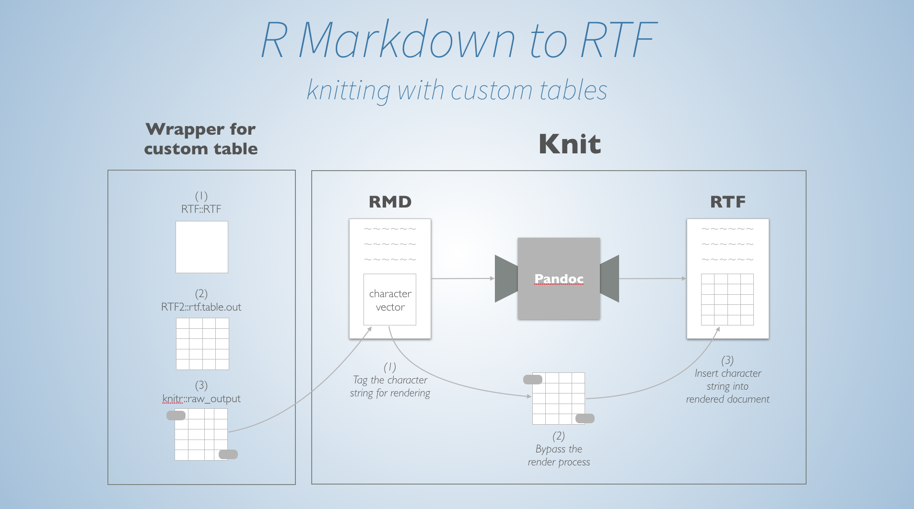

# R Markdown to RTF

You can convert R Markdown files to RTF files using the `rtf_document` output mode.

# Custom RTF code

Pandoc has limited support for RTF. If you want to create custom RTF output (e.g. using the RTF2 package) then you can effectively bypass the rendering process with the `raw_output` function in the `knitr` package. See `test-rtf.Rmd` for an example. *Note: this process currently requires development versions of the `rmarkdown` and `knitr` pacakges.*

